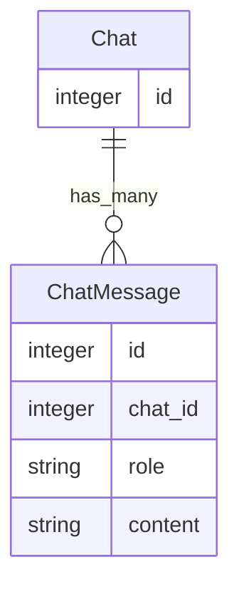
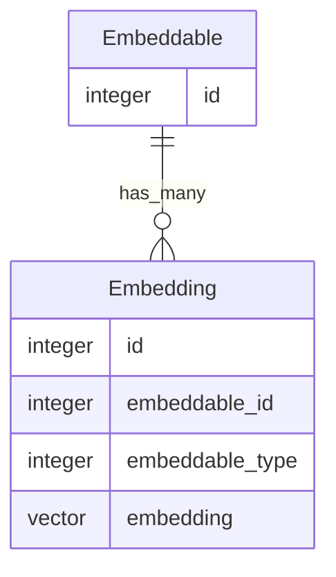

# rdh/active_intelligence README

A Rails engine that provides Rails-y AI integration

## Caveat

This engine is in (very) early development and breaking changes are expected.
Use at your own risk or contribute at your pleasure.

## Installation
Add this line to your application's Gemfile:

```ruby
gem 'active_intelligence', git: 'git@github.com:rdh/active_intelligence.git', branch: 'main'
```

And then execute:
```bash
$ bundle
```

To install migrations:
```bash
rails active_intelligence:install:migrations
```

## LLM Usage

### 1. Configuration
Configure your LLM in `config/ai/llm.yml`, something like:
```yaml
openai: &openai
  adapter: openai
  access_token: <%= ENV.fetch('OPENAI_ACCESS_TOKEN') %>
  organization_id: <%= ENV.fetch('OPENAI_ORGANIZATION_ID')  %>
  request_timeout: 120

development:
  <<: *openai
  model: gpt-4-turbo
  temperature: 0.0
```

### 2. Use the LLM

```ruby
adapter = ActiveIntelligence::LLM::Config.adapter
puts adapter.generate("Tell me a joke")
```

## ActiveRecord & ActionView Integration

### 3. app/prompts

* Prompts live in `app/prompts`.  They are ERB files that use a model as binding.
* The default prompt per-model is named after the model, e.g. `app/prompts/users.erb`
* Named prompts per-model live in a subdirectory named adter the model, e.g. `app/prompts/users/invite.erb`

### 4. include ActiveIntelligence::Promptable

Add `include ActiveIntelligence::Promptable` to your model, which adds the `#to_prompt` and `#from_llm` methods.

### 5.  Call `#from_llm` to generate a response

```ruby
default_response = user.from_llm 
invite_response = user.from_llm(:invite)
```

## Chat




### 6. Create a chat prompt

```
# app/prompts/active_intelligence/chat.erb

* Your name is Poe.  You are a fan of Edgar Allan Poe.
* You are the AI proprietor of the Raven Hotel.
* You exhibit the utmost sincerity and hospitality.
```
  
### 7. Create a chat, add a message, and get a reply

```ruby
include ActiveIntelligence

chat = Chat.create!
chat.messages.create!(role: 'user', content: "Hi!  Who are you?")
puts chat.reply.content
````

### 8.  Chat using the REPL

```
rake active_intelligence:chat
rake active_intelligence:chat[id] 
```

## Embeddings



### 1. Configuration
Configure your LLM in `config/ai/embeddings.yml`, something like:
```yaml
openai: &openai
  adapter: openai
  access_token: <%= ENV.fetch('OPENAI_ACCESS_TOKEN') %>
  organization_id: <%= ENV.fetch('OPENAI_ORGANIZATION_ID')  %>
  request_timeout: 30
  model: text-embedding-3-small

development:
  <<: *openai
```

### 2.  include ActiveIntelligence::Embeddable

```
class Greeting < ApplicationRecord
  include ActiveIntelligence::Embeddable
  
  def self.seed(text)
    create.add_embedding(text)
  end
end

Greeting.seed('Hello darkness, my old friend')
Greeting.seed('Aloha!')
```

### 3.  Perform a semantic search

```
greetings Greeting.semantic_search('Hello')  
```

### 4.  Caveats

This relies on [pg_vector](https://github.com/pgvector/pgvector) and [the neighbor gem](https://github.com/ankane/neighbor).

The included logic supports simple use cases.  
For more complex cases, you may want to add an `embedding` vector directly to your model, rather than use the `Embeddable` concern.


## ASR Usage

### 1. Configuration
Configure your LLM in `config/ai/llm.yml`, something like:
```yaml
aws: &aws
  adapter: aws
  access_key_id: <%= ENV.fetch('AWS_ACCESS_KEY_ID') %>
  secret_access_key: <%= ENV.fetch('AWS_SECRET_ACCESS_KEY') %>
  region: <%= ENV.fetch('AWS_REGION') %>
  bucket: <%= ENV.fetch('AWS_TRANSCRIBE_BUCKET') %>
  folder: <%= ENV.fetch('AWS_TRANSCRIBE_FOLDER') %>
  language_code: en-US
  
openai: &openai
  adapter: openai
  access_token: <%= ENV.fetch('OPENAI_ACCESS_TOKEN') %>
  organization_id: <%= ENV.fetch('OPENAI_ORGANIZATION_ID')  %>
  request_timeout: 300
  model: whisper-1
  
development:
  <<: *openai
```

### 2. Use the ASR

```ruby
adapter = ActiveIntelligence::ASR::Config.adapter
puts adapter.transcribe('spec/data/audio/ebn.wav')
```

## TTS Usage

### 1. Configuration
Configure your LLM in `config/ai/tts.yml`, something like:
```yaml
eleven_labs: &eleven_labs
  adapter: eleven_labs
  api_key: <%= ENV.fetch('ELEVEN_LABS_API_KEY') %>

charlie: &charlie
  <<: *eleven_labs
  voice_id: IKne3meq5aSn9XLyUdCD

development:
  <<: *charlie
```

### 2.  Use the TTS

```ruby
adapter = ActiveIntelligence::TTS.adapter
adapter.generate_file('Hello darkness, my old friend', 'tmp/hello.mp3')
```

## General Concepts

### Architecture

The engine currently has three significant modules: `ASR`, `LLM`, and `TTS`.
Each module has a common `Config` and `Adapter` pattern.

### Adapters

The config is a constructor for the adapter.  
By default, it uses the `Rails.env` as the key, but you can specify one:
```ruby
adapter = ActiveIntelligence::ASR.adapter # uses Rails.env
adapter = ActiveIntelligence::ASR.adapter(:foobar) # uses the named configuration
```

### Configuration

Values in a configuration will "flow through" to services called by the adapter, so you can set defaults in the configuration.
Options provided directly to calls will take precedence over the configuration.

## Contributing
Contribution directions go here.

## License
The gem is available as open source under the terms of the [MIT License](https://opensource.org/licenses/MIT).
